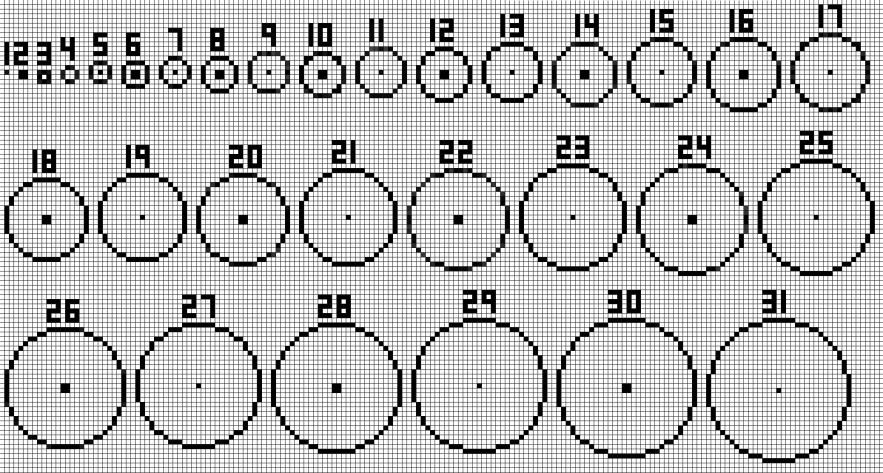

Useful WorldEdit commands
=========================
.. warning:: This document has been marked for deprecation. The information in the article may be outdated. 

List of `WorldEdit commands <https://minecraft-worldedit.fandom.com/wiki/Worldedit_Commands>`_

Some of the commands listed below might not work on all server, talk with the server owner if some of these does not work.

How to find Block IDs
---------------------
For many WorldEdit commands you can use Block IDs to reference specific block types.

To show the block IDs in the Minecraft creative menu press F3 + H. IDs will be shown as 0001/2. This translates to WorldEdit as 1:2

or visit `Minecraft Block ID reference <https://minecraft-ids.grahamedgecombe.com/>`_ to see all block IDs.

How to select a region using WorldEdit
--------------------------------------
Use the ``//wand`` (normally the wooden axe), left-click a block to select it as position 1 right-click a block to select it as position 2.

**OR**

Use the commands ``//pos1`` and ``//pos2`` to select the block you are standing on (works with air too).

**OR**

Use the commands ``//hpos1`` and `//hpos2` to select the block you are looking at at a distance.

The selected area is the area or volume between the two positions.

Beginner commands
-----------------

.. warning::
    :red:`CAREFUL`

    Do not use too big areas, as it can crash your server and completely lag out your world.

Because this project is not using normal cubes, we most of the time have to change the figure to a polygon. We have moved this first as most people are going to have use for this, so if there is anything you have a question about after reading this, you will most likely find the answer under one of the other commands.

Circles
~~~~~~~

Circles can be created easily using WorldEdit.
Filled: ``//cyl [blocktype] [radius] 1``

Unfilled: ``//hcyl [blocktype] [radius] 1``

Polygon selection
~~~~~~~~~~~~~~~~~

- With `//sel` you can change your ``//wand`` to create non square structures. The command that is the most useful is ``//sel poly``. This will change your wand into a tool that can zone out a location that is not a full square or rectangle, also known as a polygon.
- After you have done //sel poly, you can start marking your area. Left click where you want to start your polygon, and then right click all the other corners. You can select as many as you want, but the less the better.

.. image:: img/image2.png

- After you have selected the area, you can use the normal //set, //replace, //copy and //paste commands to change your build.

.. image:: img/image28.png

- When you are finished with your polygon, you can turn it back to a normal cube wand, with ``//sel cuboid``.

The most important command: ``//Undo``
--------------------------------------

- The undo command is your best friend. If you are afraid to mess up, undo is here to help you. After you have done most commands, you can do ``//undo`` to reset the last WorldEdit command you did. You can also do ``//undo 10`` to erase the last 10 actions you did.
    - A couple things to remember:
        - This will not remove flowing water, or flowing lava, if you have done ``//set`` with either water or lava, so be careful with this!
        - If you place something that has to be placed on a block, for example a flower, mid air, then everything will drop down to the floor. This can cause major lags, so double check the ID before you do any major commands.

The few basic commands
----------------------

- ``//wand`` is used to bring up the tool you are going to use for your WorldEdit commands. When you do ``//wand``, you get a wooden axe in your hand, which you can use to select regions of what you want to change. By default it is for cuboid shapes, also known as rectangles and squares. So to select an area, you left click with the wand out on one corner, and right click on the opposite corner. You now have selected the area that you want to work on.
    - You can also use ``//pos1`` and ``//pos2`` to select the area. It will take the position out of where your feet are placed, so you can easily make a mark in the sky or above ground without having to build up.
- ``//set [Block-id]`` is used to set every block in your region to a certain block. You can use both block id and name. So if i do ``//set dirt``, the entire region will change to dirt. If i do ``//set 1``, the entire region will be changed to stone.
- ``//replace [from block-id] [to block-id]`` is used to change only certain blocks into a different block in the region. so if i do `//replace dirt 1`, it will change all dirt blocks to stone blocks. You can also remove certain blocks using 0, or air. ``//replace stone 0`` will delete all stones in the area. You can also use ``//cut stone`` to remove only stone.
    - You can also use ``//replacenear [radius] [from block-id] [to block-id]`` if you do not want to mark the area. If i do ``//replacenear 100 water grass``, it will replace all water in a 100 block radius to grass centered on the player.
        - CAREFUL If you pick a too large radius number, it can crash both the server and your world. It becomes really laggy above 100 blocks.
- ``//line [block-id]`` can be used to create a diagonal line from point A to point B. Select this area with the wand. Only works with cuboid wand.
- ``/up [amount]`` is used to teleport you up a certain amount of blocks, and then place a glass block below you. This is useful if you want to select up to a certain amount of blocks above you.

Copy command
------------
The copy command is used to take a copy of something you have built, and move it to wherever you want it. The commands are ``//copy`` and ``//paste``.

.. image:: img/image24.png

You have to remember where you took the copy, because it pastes in relation to where you stood. The best idea is to stand either on a corner or in the middle of the building, on ground level. Then you move to where you want to paste it, and stand on the exact same block you stood when you did ``//copy``.

You can also do ``//rotate [degree amount]`` after you have done ``//copy`` to change the direction of the build. You can do 90, 180 and 270. It rotates clockwise. After you have rotated it, you can do ``//paste`` to place it.

If you only want to copy certain blocks, you can do ``//copy -m [block-id]`` and then 
``//paste -a ``to place them. The -m stands for mask and any blocks that do not match will be replaced with air in your clipboard. In the paste command, the ``-a`` means -air, which means you can paste only the blocks you want without changing anything about the other surrounding blocks.

Change Biome
------------
Select the area you want to change the biome of using the ``//wand``, then type ``//setbiome`` [biome] (refer to ``/biomelist``). Relaunch the world to see your changes.

A known bug is that the biome only changes in a few chunks or that the biome reverts back to the original in some chunks. The only fix we have for this, is to do the command in smaller areas. We do not have a fix for biomes reverting.

Stacking
`Stacking gif <https://gfycat.com/magnificentincredibleeland>`_

Really good for making skyscrapers. Build the first floor of you building, and do ``//stack [floor amount] [direction]``. This will rise your building up the amounts of floors you have chosen. The direction can be up, down, north, south, east or west.

Make sure the building height is correct after doing the stack command, as it might not be exactly as high as it is supposed to be.

Brush commands
--------------
The Brush command rewrites what a tool does. You know how right clicking on grass with a hoe will create farmland? With the brush command we can make any tool do a terraforming action. As this action is bound to a tool you need to choose a tool to overwrite. You can choose any tool (hoes, pickaxes, shovels even compasses and swords) except for the wooden axe (it is the WorldEdit wand so you better not overwrite it)

Sphere brush
~~~~~~~~~~~~
We now need to make this tool a brush. While holding the tool use the command: ``/brush sphere [blocktype(s)] [radius]`` So when we use the command ``/brush sphere stone 3``  Your tool has become a “sphere brush”. If you right click a ball of stone will appear. This ball has a radius of 3 blocks.

* A variation of this would be if you want a ball that is mixed e.g. stone and dirt. For this you use the command ``/brush sphere stone,dirt 3``. You can create a mixture of any number of block types. If you do this the block types will be equally distributed. What if you want a ball that is 80% stone and 20% dirt? No problem ``/brush sphere 80%stone,20%dirt 3`` will do the trick.
    * You can use this command to create a mountain very quickly, but it will look like it is made from balls. We need a smoothing tool to fix that.

Smoothing brush
~~~~~~~~~~~~~~~
Choose another tool to rewrite and use the command ``/brush smooth [radius]`` (e.g. ``/brush smooth 4``) to create a smoothing brush. If you right-click this brush you will smooth out the landscape.

Mask brush
~~~~~~~~~~
So far our tools have affected all blocks. The sphere brush has replaced air, grass and stone and the smooth brush has smoothed all block types. We can change this by applying a mask to our brush.
As an example we will create two brushes that can be used to create gigantic farms in seconds.
The first brush will paint the farm land.
Choose a tool and use the command ``/brush sphere 90%farmland,10%water 4`` . This will create a sphere tool that draws a ball of farmland and water.
We only want to affect the top layer with this brush so we use the command ``/mask grass`` to selectively replace grass blocks. (If your top layer is some other block choose that instead of grass)
Now we can create farmland with water sources by right-clicking.
To quickly add the wheat on top we use a wheat plant sphere brush ``/brush sphere wheat 4`` but we only want the wheat to show up on top of farmland so we mask it with ``/mask >farmland``

Using schematics in BTE
-----------------------
Schematics are a great way to transport and reuse your builds. This means you can:

#. Move a build from a single player world to a server
#. Reuse a build you have already done in a different part of the world without having to ‘select- ``//copy``-``//paste``’ every time.
#. Upload and share your build on the discord for everybody else to use.

The schematic command of WorldEdit has some limitations that come into play when it is used in the context of the BTE project.

* **Limitation 1:** You can only make a schematic of a build that is smaller than 256 blocks in height. Builds that are taller than 256 blocks have to be put in multiple schematics.

* **Limitation 2:** The Schematic command does not seem to work well if you are far away from the spawn at 0,0,0. As this will be the case in nearly all places in the World we have to move all builds to the spawn before creating the schematic.

Creating Schematics in BTE
~~~~~~~~~~~~~~~~~~~~~~~~~~

#. Make sure that your build is smaller than 256 blocks in height (make multiple schematics otherwise)
#. Select your build using the WorldEdit ``//wand``
#. ``//copy`` your build
#. Teleport to the spawn ``/tp [playername] 0,0,0``
#. ``//paste`` the build close to the spawn
#. Reselect the pasted build using the WorldEdit ``//wand``
#. Create the schematic using ``//schematic save [filename]`` (Make sure you use a unique and descriptive filename. Replace space with “_” or “-”)

The schematic will be saved as a .schematic file in the ``worldedit/schematics`` folder in your ``.minecraft/config/worldedit/schematics`` (or ``twitch/.minecraft/config/worldedit/schematics``) directory.

You can check if the schematic has been created correctly by uploading it to `cubical.xyz <https://cubical.xyz/>`_.

Transfering the schematic to a server
~~~~~~~~~~~~~~~~~~~~~~~~~~~~~~~~~~~~~
Upload the schematics into ``config/worldedit/schematics`` in your server. If you are not the owner of the server contact the server admin.

Sharing a schematic to the community
~~~~~~~~~~~~~~~~~~~~~~~~~~~~~~~~~~~~
If you have created something that might be useful for other builders (vehicles, traffic lights, other props) you can upload the schematics in the #public-assets channel. Here are some guidelines for that:

#. Please make sure that the filename of the schematic is descriptive and written in English.
#. Please provide a screenshot of the build so people know what they get from the schematic.

Loading and pasting a build from a schematic
~~~~~~~~~~~~~~~~~~~~~~~~~~~~~~~~~~~~~~~~~~~~
To load a schematic go to the place of your choice and load the schematic by using the command ``//schematic load [filename]`` (filename without the .schematic extension).

Paste the schematic using ``//paste.``

Complicated (but doable) commands
---------------------------------

Selecting multiple block types
~~~~~~~~~~~~~~~~~~~~~~~~~~~~~~

- This is a feature that you can use on most other WorldEdit commands we have gone through here. The basic idea is that can add multiple blocks in the same command line, so that all of the blocks you have chosen are the only ones that moves or changes. You can do this by separating the blocks with a comma [,]. If you do this with ``//set`` or ``//walls``, you get randomized amounts of blocks
    - To randomize different types of blocks within a ``//set`` command, you do ``//set [block-id],[block-id]`` For example: ``//set grass,cobblestone``. This will randomize the blocks. You can also control this by adding % to the command, example: ``//set 20%grass,80%cobblestone``
        - This can be done with ``//set`` and ``//walls``

//deform
~~~~~~~~
`worldedit deform <https://minecraft-worldedit.fandom.com/wiki///deform>` <- I added this just there is at least something here until someone can add a real tutorial on it