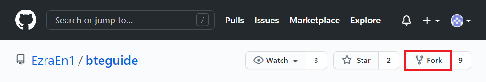
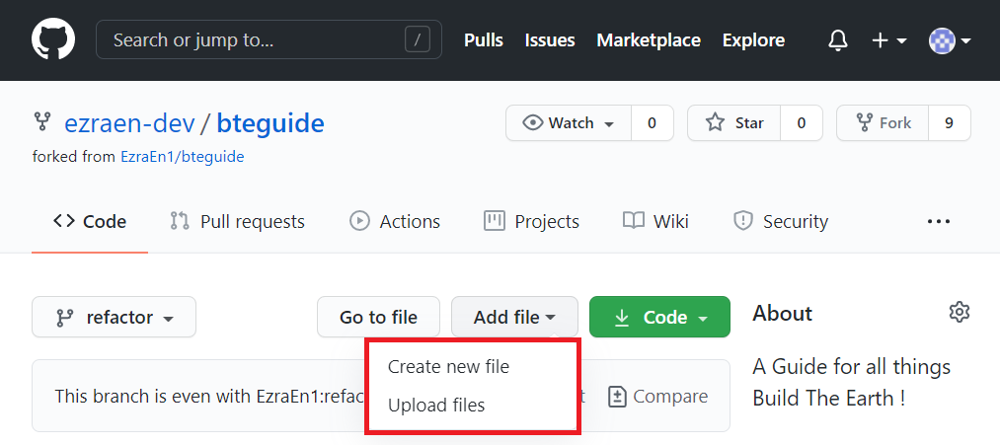
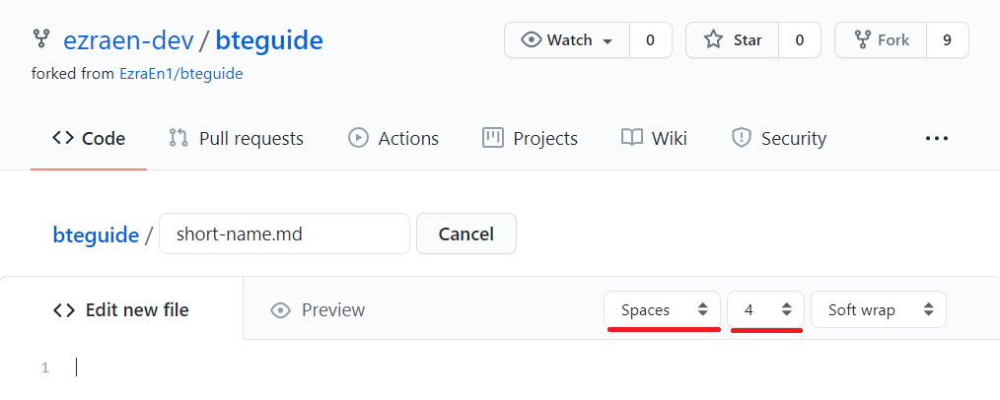

<!---
title: Contributing to the Docs
path: /onboarding/contributing
version: 1.1.1
last-updated: 
authors:
  - @ezraen1
--->
``` .. todo:: Refactor links to utilise RCM's impl of extlink (path/to/document:heading) bc long relative links are a no-no
```
Contributing to the Docs
=======================
```eval_rst
.. admonition::
  Prerequisites
  
  1. Familiarity with Markdown/reStructuredText.
  2. `A Github account. <https://github.com/join>`_

      Github is a web interface for collaboration using remote git repositories. The wiki is created in such a remote repository,  and you're looking at it right now! You will need an account to collaborate with the team. Create a Github account.
```

Setting up the environment
--------------------------


After you have created a Github account click the **Fork** button in the top right of the [BTEGuide Github repo](https://github.com/EzraEn1/bteguide). This will create a copy of the whole wiki project on your own Github account. You can work on this copy without affecting any of the main wiki.


Uploading your Content
----------------------

Once you know what content you're going to add, the next step is to find where is should go. Use the **Navigator** to do that.

When you find exactly where you want your content to go, click **Add File** and use [**Create new file**](#writing-text) or [**Upload files**](#uploading-media) to upload it to your repo.




Writing Text
------------



If you chose to **Add File**, you will find a rather minimalist Markdown Editor. Name your document with an appropriate [dash-case](https://en.wikipedia.org/wiki/Naming_convention_(programming)#Examples_of_multiple-word_identifier_formats) short name, and by copying and [following the Template Page](./using-template.md), modify and write the documentation you intend to write.

```eval_rst
.. warning:: The Github Markdown Editor does not save your progress like Google Docs. Should you wish to save your draft, either do so by keeping a local copy (`by cloning the repo locally`_) or by storing your writing somewhere else.

.. _by cloning the repo locally: https://docs.github.com/en/github/creating-cloning-and-archiving-repositories/cloning-a-repository
``` 


Uploading Media
---------------
```eval_rst
.. todo:: 
  write this thing, because being able to upload pictures is pretty useful
```

Translating the Docs
====================

For those who are familiar with how Sphinx handles internationalization, you will know that it is a terribly convoluted process for translators, requiring a whole build process and a great tolerance for .po files. No more. 

Suggested Workflow
------------------

To begin work on a new language, simply create a new folder named after your target language's [2-letter shortcode](#language-code-lang) next to the `/en/` directory. From there, copy and paste the entire contents of the `/en/` folder and find the document you seek to translate, changing the metadata as explained below.

Additions to the Metadata
-------------------------

Building off of the [Writing Text](#writing-text) section, translation requires the use of a [slightly different template page](/_sources/bteguide/en/onboarding/contributing/translated-template-page.md.txt).

Unlike the [regular template page](./using-template.md), the template metadata is slightly different for many good reasons, most of all to help translators keep track of their translations across source material changes. All other metadata not explicitly declared here should not be modified from the source document for management's sake.

### Language Code `lang:`

  This is your target language's 2-letter shortcode following the standard set out in [ISO 639-1](https://en.wikipedia.org/wiki/List_of_ISO_639-1_codes). 

  Exceptions to this rule are:
- Simplified Chinese: `zh-CN`
- Traditional Chinese: `zh-TW`

  Should there be any macrolanguage exceptions not accounted for, please open a GitHub issue accordingly.

### Translation Version `lang-version:`

  This is the version of your translation. Following the standards set out in the regular [metadata format](./using-template.html#document-version-version), this language-specific version operates independently of the source version value. When the source is updated, this version should be reset to `1.0.0` to reflect that the translation target has changed. Of course, already translated content need not reset accordingly.

### Translator List `translators:`

Yes, translators get a chunk of the recognition pie too! Add your Github Handle to the list, and your alternate name if we know you by any other name, the format is exactly the same as the [Author List](./using-template.html#author-list-authors)

Shortcomings of the Workflow
----------------------------

The unfortunate result of trying to flatten and simplify both the document writing experience and the translation methodology means that short of modifying `sphinx-intl` or writing our own build tool, there is currently no elegant way to ensure that: 
- Translated documents are correctly linked to their source documents (via language switcher)
- Untranslated document links are properly redirected/shown their updated source equivalents.

If you have any ideas as to how we can resolve these issues, we have a Discussion ongoing in the Github repo.


Project Structure
=================

Here we have the basic outline for the rest of the project. Following the outline helps us categorise our content, allowing readers to more easily find what they're looking for.

- Onboarding (First introduction to BTE/BTEGuide)
    - Installation 
        - Java
            - Windows
            - macOS
            - Linux
        - Bedrock
            - Windows
            - Mobile
            - Console
                - PlayStation
                - Xbox
                - Wii
                - Switch
                - ... (are there any more that we missed? rPi?)
- Foundation (More for builders to get in the flow of things, should be next step after Onboarding)
    - Building Guidelines
    - Building Workflow
        - Choosing Singleplayer / Multiplayer?
- Advanced (Based off old Google Docs and Archive sources)
    - Builder “Codelabs” (Would be a better alternative to the current state of the Archive)
    - Tips (like Python “Tricks”)
    - Server Setup
    - Technical Guide (not sure how much of the existing Tech Guide is usable content)
- FAQ (It’s at the end of the guide for a reason. Everything else should be answered by the guide itself.)
