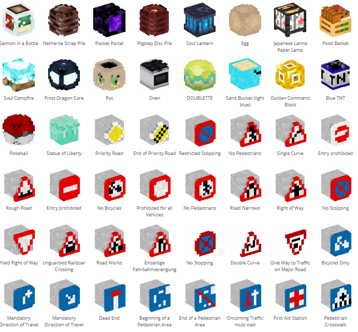

Building Tips
=============
.. warning:: This document has been marked for deprecation. The information in the article may be outdated. 

This is general tips on how to build certain styles of thingies. There will be pictures comparing real life to the built object in game. (just need to find the tips and add pictures)

General tips
------------
Powered iron trapdoor can be made using WorldEdit. First you place an iron trapdoor, and then you power it. Then you select it, and do ``//copy`` and ``//paste`` it to where you want it. This way you can create cool smaller barriers:

.. table::

    ==========================  ==========================
    .. image:: img/image19.png  .. image:: img/image11.png
    ==========================  ==========================

Block color overview
--------------------
Here you can see an ordered overview of the colored blocks in Minecraft.

.. image:: img/image17.png

Custom heads
------------

Minecraft player heads can be used to add details to builds.

You can find thousands of heads in the `Minecraft Head Gallery <https://minecraft-heads.com/>`_ or `Gallery2 <https://freshcoal.com/maincollection>`_

    

#. Copy the version 1.12.2 command from the gallery.
#. Give yourself a command block: ``/give [name] command_block [amount]`` or ``/i commandblock on some servers.``

#. Paste the command from the gallery into the command block(You might also have to change `minecraft:banner` to `banner` in the command).
#. Give a redstone signal to the command block (e.g. with a button or lever).

    .. image:: img/image8.png

#. Custom heads can be places on the side and on top of blocks (see picture).
#. A good idea is to spawn in a stack of them, and then just adding them to a chest for easy access, so you can avoid using the command block over and over again.

See also `List of useful Minecraft heads and banners <>`_

Custom banners
--------------

.. image:: img/image23.png

Custom banners are used almost in the same way as custom heads. Find the design you like on `Minecraft Tools <https://minecraft.tools/en/banner-galery.php>`_.

#. Find the banner you like, and click on it. Scroll down to the command line, and click Display old versions commands.
#. Give yourself a command block: ``/give [name] command_block [amount]`` or ``/i commandblock`` on some servers

#. Paste the command from the gallery into the command block.
#. Give a redstone signal to the command block (e.g. with a button or lever).
#. You are ready to place!
#. A good idea is to spawn in a stack of them, and then just adding them to a chest for easy access, so you can avoid using the command block over and over again.

See also `List of useful Minecraft heads and banners <>`_

Other blocks only spawnable with commandblock or WorldEdit
----------------------------------------------------------
**Mushroom blocks ID** 99:11+ 99:15

.. image:: img/image21.png

Use 99:11 + 99:15 in WorldEdit as block id::

    /give @p command_block 1 0 {BlockEntityTag:{Command:"setblock ~ ~ ~ brown_mushroom_block 11",auto:1b}}

    /give @p command_block 1 0 {BlockEntityTag:{Command:"setblock ~ ~ ~ brown_mushroom_block 15",auto:1b}}

**Smooth sandstone**
Use 43:9 in WorldEdit as block id

Spawn the block in with the command: ``/give @p command_block 1 0 {BlockEntityTag:{Command:"setblock ~ ~ ~ double_stone_slab 9",auto:1b}}``

This will give you a command block in your inventory with the correct command set in, so all you have to do is place it where you want it to be.

.. image:: img/image6.png

**Smooth double stone slab**

Use 43:8 in WorldEdit as block id

Spawn the block in with the command: ``/give @p command_block 1 0 {BlockEntityTag:{Command:"setblock ~ ~ ~ double_stone_slab 8",auto:1b}}``

* This will give you a command block in your inventory with the correct command set in, so all you have to do is place it where you want it to be.

**Structure blocks**

Structure blocks are a different type of blocks that not a lot of people know exists. Getting the first type of block is easy, getting the rest requires a bit more work.

.. image:: img/image12.png

You can spawn in the data block with commands or WorldEdit

* ``/give [your name] structure_block 1``
* in WorldEdit the ID is structure_block

In order to get the other blocks, you have to first place down the first data structure block. Then you click on it, and click the data button. This will change the block to a save block. Clicking the save button at the bottom left, will change it into a corner block. Clicking the corner button, will change it back to a data block.

* Once you have the block you want, you have to manually ``//copy`` and ``//paste`` the block to wherever you want it. There might be a faster way, but i have no found it yet. Feel free to add it in the suggestion form on the top.

Buildings
---------

Building at an angle can be very hard. here are some helpful images.

.. image:: img/image25.png
.. image:: img/image3.png
.. image:: img/image20.png

Building detail [c]_ [d]_ [e]_ [f]_
-----------------------------------

.. table::

    +--------------------------+----------------------------+--------------------------------------------------------+
    |.. image:: img/image1.png | .. image:: img/image14.png | Glass panes are the simplest way to make nice looking  |
    |                          |                            | windows. It is impossible to get it correctly to scale,|
    |                          |                            | so try to get it as close as possible, as done here.   |
    +--------------------------+----------------------------+--------------------------------------------------------+
    | ATM                                                                                                            |
    +--------------------------+----------------------------+--------------------------------------------------------+
    |.. image:: img/image10.png| .. image:: img/image4.png  | A neat looking ATM with a dropper and button in front, |
    |                          |                            | with a powered iron trapdoor on the side               |
    +--------------------------+----------------------------+--------------------------------------------------------+

Streets, Roads and Paths
------------------------

.. image:: img/image7.png 

Lamp posts
~~~~~~~~~~

.. table::

    +--------------------------+--------------------------+
    |.. image:: img/image29.png|.. image:: img/image35.png|
    +--------------------------+--------------------------+
    | Cobble walls with smooth stone slabs                |
    +-----------------------------------------------------+

.. table::

    +--------------------------+---------------------------------------+
    |.. image:: img/image5.png |             .. image:: img/image27.png|
    +--------------------------+---------------------------------------+
    | Netherbrick fence with redstone lamp and a daylight sensor at top|
    +------------------------------------------------------------------+

.. table::

    +--------------------------+---------------------------------------+
    |.. image:: img/image32.png|             .. image:: img/image31.png|
    +--------------------------+---------------------------------------+
    | Cobblestone walls with stone half slabs and redstone lamp        |
    | with a daylight sensor on trapdoor                               |
    +--------------------------+---------------------------------------+

.. table:: A Minecraft `head <>`_ (banana bunch) on top of iron bars and cobble wall

    +--------------------------+---------------------------------------+
    |.. image:: img/image37.png|             .. image:: img/image9.png |
    +--------------------------+---------------------------------------+

Rail lines
----------

Oganexon#2001 has created a mod for BTE called `BTE Tools <https://github.com/oganexon/BTE-tools>`_, that gives some cool additional commands for the creation of rail lines.

You can follow the download and install setup on the the download page. This mod only has to be installed on the server, or on the client if you are playing single player.

After you have installed the mod, you can run the commands in the world, and you will get these cool lines for where the railroads are.

.. image:: img/image36.png

Terraforming
------------

How to lower or raise
~~~~~~~~~~~~~~~~~~~~~

.. table::

    +-------------------------------------------------------------------------------------------------------+--------------------------+
    |1. Find the location you want to change.                                                               |.. image:: img/image15.png|    
    |2. do ``//sel poly`` to select the wand that marks regions that are not your usual square or rectangle.|                          |
    |3. Mark the entire area you want to change, i have marked them with diamonds here to show where i mark |                          |
    +-------------------------------------------------------------------------------------------------------+--------------------------+
    |4. Stand still and do the ``//copy -m [blocks]`` command to select the blocks you want to move up.     |.. image:: img/image34.png|
    |   I use ``//copy -m 208,2,45,251:7``                                                                  |                          |
    |\This will copy all the blocks that are part of the generation, paths, grass, bricks and roads.        |                          |
    +-------------------------------------------------------------------------------------------------------+--------------------------+
    |5. Place the same amount of blocks that you want to raise the floor below you.                         |.. image:: img/image26.png|
    |   So i want to raise it up by one block, so i place one block below me.                               |                          |
    |   If you want to lower it, you just dig down the amount of blocks you want to lower.                  |                          |
    |6. Then i can do ``//paste -a`` to paste in the blocks that i have copied.                             |                          |
    |7. Another way to do it is to use ``//move [amount] [direction] [leave-id]``. Select the area with wand|                          |
    |   , and then you can for example do ``//move 1 up dirt`` to move it all one block up.                 |                          |
    |   Then it will leave dirt blocks on the location where you moved the blocks from.                     |                          |
    |   If you are building up a building, you can stand still, do the ``//copy`` command first, then do    |                          |
    |   ``//move`` command, and then ``//paste`` to not lose any blocks.                                    |                          |
    +-------------------------------------------------------------------------------------------------------+--------------------------+

How to lower bigger areas
~~~~~~~~~~~~~~~~~~~~~~~~~
You can do this on any size you want, I've done a smaller area to better show the details. Try not to choose an area too big, as that can cause massive lags and server timeouts.
Thanks to mcnoided#4059 for this great tip

.. table::

    +--------------------------------------------------------------------------------------------------------+--------------------------+
    |1. Select the entire area with //sel poly, extending down to the lowest part of the actual terrain.     |.. image:: img/image39.png|
    |   I have marked it here with diamond blocks. **This region selection is going to remain until you are  |                          |
    |   done, so do not change your selection unless stated otherwise.**                                     |                          |
    |2. Then you do ``//replace !208,45,251:7 0`` This will turn all the blocks that aren't path, brick or   |                          |
    |   gray concrete to air.                                                                                |                          |
    |*If you are doing a terrain with different terrain levels, you will have to use Google Earth to mark    |                          |
    |where the elevation changes and connect each layers points with ``//curve`` in ``//sel convex`` or      |                          |
    |``//line`` in the default ``//sel cuboid``, and then fill in the missing terrain with ``//fill``.*      |                          |
    +--------------------------------------------------------------------------------------------------------+--------------------------+
    |3. Next step is to replace every brick, paths and gray concrete into a block that has gravity, either   |.. image:: img/image40.png|
    |   concrete powder, sand or gravel. I use gravel for bricks, sand for paths, and concrete powder for the|                          |
    |   roads. It is important that you do different gravity blocks for different blocks. So these are the   |                          |
    |   commands i write in:                                                                                 |                          |
    |.. code-block::                                                                                         |                          |
    |                                                                                                        |                          |
    |   //replace 251:7 252:7                                                                                |                          |
    |   //replace 45 14                                                                                      |                          |
    |   //replace 208 12                                                                                     |                          |
    +--------------------------------------------------------------------------------------------------------+--------------------------+
    |4. Once you have done all the different blocks, you want to add another point to your region selection  |.. image:: img/image41.png|    
    |   in the ground which the terrain is going to be on. At this point, you are going to add one block     |                          |
    |   below the gravity blocks. These are the commands i use for that:                                     |                          |
    |.. code-block::                                                                                         |                          |
    |                                                                                                        |                          |
    |   //replace <252:7 251:7                                                                               |                          |
    |   //replace <14 45                                                                                     |                          |
    |   //replace <14 5                                                                                      |                          |
    |..                                                                                                      |                          |
    |                                                                                                        |                          |
    |You have to temporarily have your path blocks as another block, or else the sand will turn the path     |                          |
    |blocks into dirt. I have used planks here.                                                              |                          |
    +--------------------------------------------------------------------------------------------------------+--------------------------+
    |5. Now you can do this command: ``//replace 252:7,14,12 0`` This will remove all the gravity blocks, and|.. image:: img/image42.png|    
    |   if you have done everything correctly, all the blocks should now be in place below.                  |                          |
    +--------------------------------------------------------------------------------------------------------+--------------------------+
    |6. Then it is just to change the blocks around to the blocks you want, and fix up the place.            |.. image:: img/image43.png|    
    |   One fast way to replace all the things you find in the ground, is to use this command:               |                          |
    |   ``//replace !251:7,45,208,0 2``                                                                      |                          |
    +--------------------------------------------------------------------------------------------------------+--------------------------+

How to make rivers
~~~~~~~~~~~~~~~~~~
Credit to mcnoided#4059 for this tip.

#. Use Google Earth to mark points of the walls and connect the points with ``//curve`` in ``//sel convex`` for the curved parts and ``//line`` in the default ``//sel cuboid`` for the straight parts

#. Close them off at a reasonable length, I suggest doing about 500 meters at a time

#. Do ``//fill 20 300`` to create a layer of glass

#. Select the entire foundation with ``//sel poly``, and use ``//stack [amount] down -a`` to stack the foundation down to the depth you want.

#. ``//expand [amount] down`` so that the selection covers at least all the way to the bottom, and then ``//replace 20 8`` to replace all the glass blocks to water source blocks.

* If there is water covering up your location, you can change the water using ``//replace`` commands or ``//mask`` commands.
* Some buildings can be mistaken for hills, so that the terrain generation makes a giant hill as well as the building outlines. You can check the elevation using google earth pro. If you hover over the location you want to see the elevation to, you can see the number on the bottom of the page, on the black line with all the numbers.
* To cover up a cave, select the corners of the caves using ``//wand`` (either with ``//sel poly`` or normal wand) and do ``//replace air grass``. This will change all air blocks to grass blocks.
* To remove nearby trees, you can do ``//replacenear 100 log,18,106 0``. This will remove all logs, leaves and vines in a 100 block radius.

Nature
------

Leave block IDs that do not decay
~~~~~~~~~~~~~~~~~~~~~~~~~~~~~~~~~

| Oak ``18:4`` 
| Spruce ``18:5`` 
| Birch ``18:6`` 
| Jungle ``18:7`` 
| Acacia ``261:4`` 
| Dark Oak ``261:5``.

Creating a forest with custom trees
~~~~~~~~~~~~~~~~~~~~~~~~~~~~~~~~~~~

Planting a bunch of trees have never been easier! A video tutorial on how to use it is found `here at 4:45 <https://youtu.be/hoSwiOyPQWA?t=285>`_. The idea is to create a brush with a tree clipboard on it.

#. At first you have to build the tree you want to place everywhere. This can either be done on the ground or in the air.
#. Then you select the entire area of the tree with your wand, move up to right in front of the tree center on the ground, and do ``//copy [block id]`` So if you use a regular tree, you do ``//copy 17,18`` You can add more ids by separating it with a comma.
#. Select a tool from the creative inventory, and hold it in your hand. This can be any tool, for example a golden axe, or a wooden hoe. Do ``//br clipboard -a -p``

   #. You might get an error message that says “Maximum brush size radius (in configuration): 6” `Here <https://docs.google.com/document/d/1oIdUn9GFXpiducTJJYKiuQNDbpyYB9gGSEUNuBNjZGE/edit#heading=h.nxegwrt5podz>`_ is a guide on how to fix that.

#. At this point your brush is ready! Right click with your tool out to place a tree. To get the best effect, it's better to have several different tree shapes binded to different tools. 

Controlling the the length of vines
~~~~~~~~~~~~~~~~~~~~~~~~~~~~~~~~~~~
To avoid having vines grow longer than you want, you can add barrier blocks to stop the growing. An alternative is string, but barrier blocks are completely invisible. 
Use ``/give [your name] barrier 64`` to add barrier blocks to your inventory.

Building shells and outlines
----------------------------
`PippenFTS has made a video on this! <https://youtu.be/oVvxjMHoWEg?t=136>`_ The tutorial part starts at 2:16, but look through the entire video before you start to build the building. If you wish for a detailed explanation on this to be added here, please message @Aquaday#6574 on the discord server.

We have a list of useful outline commands and tips `on this link <https://docs.google.com/document/d/1psXzI9IDxfzcw7PbSe_QdGwBAIiMwlSL0UIo79uBZBc/edit#heading=h.8p7cyxb5lk9y>`_. Show you how to fast and easy build up walls, either same blocks or different, and also shows you how to work with skyscrapers

`Non-straight Building outlines tutorial <https://www.youtube.com/watch?v=PfYwp43vdGs&feature=youtu.be>`_ This is a way to make outlines in a non straight building.

BTE Normalization
-----------------
Some community members have come together to develop standardized blueprints for common objects in the world. Check out their github page: `BTE-Normalization github <https://bte-n.github.io/EN/Index#n3>`_ to get ideas about how to build some common things like trains, planes, parking lots. This project is a work in progress and will grow overtime.

.. rubric:: Footnotes

.. [c] i might want to move this down to the bottom, as it is going to be filled up with examples
.. [d] I agree, we could try to compess some of the examples by putting them next to each other.
.. [e] Yeah but we also dont want it too small as it would make it harder to actually see what they have done. You can easily zoom in on mobile, but its a bit different on computer, and you also can not open the image in a new window for some reason.
.. [f] That is true.
   
   Depending on how many examples we collect it might even be worth thinking about a second document dedicated  just to example comparisons. At the moment that would maybe be unessecary but in the long run we might collect thousands of comparison examples.

   Personally, I imagine myself looking at the example comparisons a lot more often than the rest of the guidebook so you could say that the two things are rather distinct from each other. Having them in two different documents might therefore even be easier to use for the builders.

   But I guess we have to see how it develops
